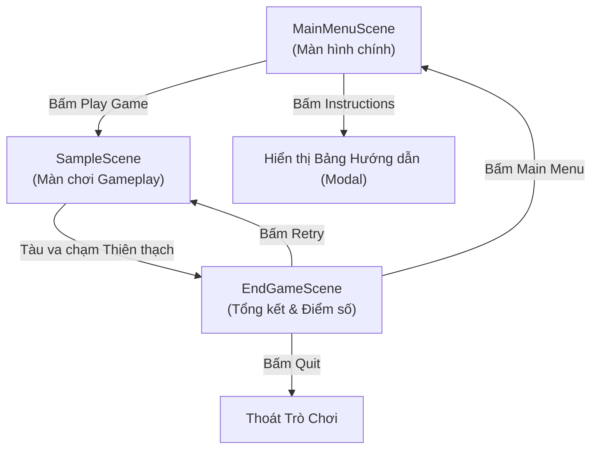

# 🚀 Space Explorer - 2D Unity Game

> **Môn học:** PRU213 - 2D Game Development with Unity  
> **Sinh viên:** Nguyễn Văn Điệp  
> **MSSV:** QE180203  
> **Công nghệ:** Unity 6 (6000.3.23f1) | C# (.NET Standard 2.1) | Visual Studio 2026  

---

## 📖 Giới thiệu Dự án (Project Overview)
**Space Explorer** là một tựa game 2D arcade thể loại bắn tàu không gian (Space Shooter). Người chơi sẽ điều khiển một chiếc phi thuyền không gian thám hiểm dải ngân hà, né tránh các đợt thiên thạch nguy hiểm và bắn hạ chúng bằng tia laser, đồng thời thu thập các ngôi sao năng lượng để tích lũy điểm số tối đa.

Dự án áp dụng đầy đủ các kiến thức cốt lõi của Unity:
- Hệ thống GameObject, Transform và Component.
- Vật lý 2D, Trigger va chạm (`Collider2D`, `Rigidbody2D`).
- Quản lý trạng thái và dữ liệu xuyên suốt các màn chơi (`PlayerPrefs`, Singleton Pattern).
- Thiết kế giao diện người dùng responsive (`Canvas`, `TextMeshPro`, `RectTransform`).
- Điều hướng và chuyển đổi mượt mà giữa các Scene (`SceneManagement`).

---

## 🎮 Cách chơi & Phím điều khiển (Controls)

| Thao tác | Phím bấm | Mô tả |
| :--- | :--- | :--- |
| **Di chuyển** | `Phím Mũi Tên` hoặc `W`, `A`, `S`, `D` | Điều khiển tàu bay đa hướng 8 chiều |
| **Bắn đạn Laser** | `Phím Space` (Cách) | Bắn luồng tia laser về phía trước |
| **Né Thiên thạch** | Di chuyển khéo léo | Đâm phải thiên thạch tàu sẽ phát nổ $\rightarrow$ **Game Over** |
| **Thu thập Sao** | Chạm vào Ngôi sao | Tích lũy **+100 điểm** mỗi sao |
| **Bắn hạ Thiên thạch** | Bắn trúng bằng Laser | Phá hủy thiên thạch và nhận **+50 điểm** |

---

## 🗺️ Cấu trúc các Scene (Game Flow)

Dự án được phân chia thành **3 Scenes** theo đúng luồng trò chơi chuẩn:



1. **`MainMenuScene` (Màn hình chính):**
   - Nền vũ trụ tĩnh và tàu thám hiểm trang trí.
   - Tiêu đề game phát sáng với hiệu ứng TextMeshPro.
   - Nút **PLAY GAME** chuyển vào màn chơi chính.
   - Nút **INSTRUCTIONS** mở bảng hướng dẫn người chơi với độ tương phản cao, định dạng màu trực quan cho từng phím bấm. Có nút **CLOSE** đóng bảng.
2. **`SampleScene` (Màn chơi Gameplay):**
   - Chứa tàu vũ trụ của người chơi, hệ thống giới hạn biên camera.
   - **Spawner:** Tự động sinh ngẫu nhiên thiên thạch và ngôi sao từ rìa trên màn hình theo thời gian định kỳ.
   - UI hiển thị điểm số thời gian thực (`Score: X`).
   - Xử lý va chạm vật lý `2D Trigger` và chuyển màn khi Game Over.
3. **`EndGameScene` (Màn hình kết thúc):**
   - Hiển thị tiêu đề **GAME OVER**.
   - Đọc và hiển thị tổng điểm người chơi đạt được (`Final Score: X`).
   - Nút **RETRY** (chơi lại ngay), **MAIN MENU** (về màn hình chính), **QUIT** (thoát game).

---

## 📁 Cấu trúc Thư mục & Mã nguồn (Architecture)

```text
Assets/
├── Prefabs/                         # Các mẫu đối tượng dựng sẵn
│   ├── Asteroid.prefab              # Thiên thạch / quái vật
│   ├── Laser.prefab                 # Tia laser bắn ra từ tàu
│   └── Star.prefab                  # Ngôi sao thu thập điểm
├── Scenes/                          # Các màn chơi
│   ├── MainMenuScene.unity          # Giao diện Menu chính
│   ├── SampleScene.unity            # Màn chơi Gameplay
│   └── EndGameScene.unity           # Màn chơi Game Over & Tổng kết điểm
├── Scipts/                          # Mã nguồn C# điều khiển
│   ├── PlayerController.cs          # Điều khiển chuyển động tàu, bắn đạn, khóa biên camera
│   ├── Laser.cs                     # Hành vi bay thẳng và va chạm của tia laser
│   ├── Asteroid.cs                  # Tốc độ, góc quay ngẫu nhiên, trừ điểm/phá hủy tàu
│   ├── Star.cs                      # Hành vi trôi nổi và cộng điểm khi tàu chạm vào
│   ├── Spawner.cs                   # Tự động sinh ngẫu nhiên Asteroid và Star ngoài biên
│   ├── GameManager.cs               # Singleton quản lý điểm số và chuyển scene khi chết
│   ├── MenuManager.cs               # Quản lý sự kiện các nút UI và chuyển đổi màn chơi
│   └── CameraFrame.cs               # Hỗ trợ vẽ khung nhìn Camera trong cửa sổ Scene
└── Sprites/                         # Tài nguyên đồ họa
    ├── SpaceBackground.jpg          # Ảnh nền vũ trụ độ phân giải cao
    └── Stylized 2D Space Shooter/   # Bộ sprite tàu, đạn và thiên thạch
```

---

## ⚙️ Yêu cầu cài đặt & Chạy dự án (How to Run)

1. **Phần mềm yêu cầu:**
   - **Unity Hub** & **Unity Editor 6000.3.23f1 (Unity 6)**.
   - **Visual Studio 2026 / 2022** (đã cài workload *Game development with Unity*).
2. **Cách mở dự án:**
   - Khởi động **Unity Hub** $\rightarrow$ chọn **Add project from disk** $\rightarrow$ chọn thư mục dự án `SpaceExplorer`.
   - Đảm bảo chọn đúng phiên bản Editor `6000.3.23f1`.
3. **Chạy game:**
   - Trong cửa sổ Project, mở Scene: `Assets/Scenes/MainMenuScene.unity`.
   - Nhấn nút **Play ▶** trên thanh công cụ để trải nghiệm game.

---

## 📝 Bản quyền & Tài nguyên (Credits)
- **Engine:** Unity Technologies.
- **Graphic Assets:** *Free Stylized 2D Space Shooter Pack* by Larzes (Unity Asset Store).
- **Phát triển bởi:** Nguyễn Văn Điệp - MSSV: QE180203.
